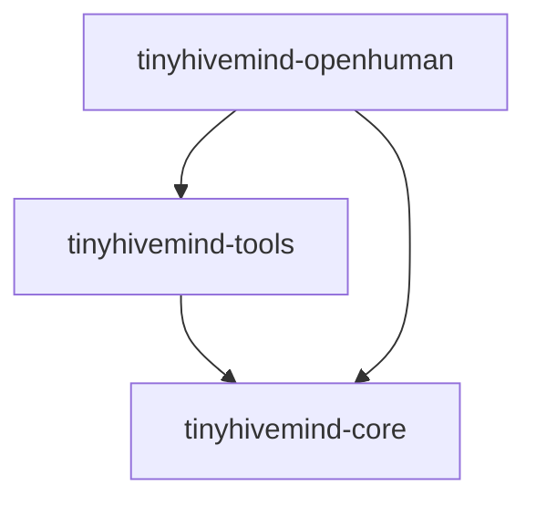

# How the crates use each other

The workspace has three crates. An arrow points from a dependent crate to the
crate it imports.

| Crate | Responsibility | External dependency boundary |
| --- | --- | --- |
| [core](../crates/tinyhivemind-core/README.md) | Grammar, session ports, hive folds, routing, TypeSafe System One, and completion driver | Host-supplied ports; no harness or transport |
| [tools](../crates/tinyhivemind-tools/README.md) | Episode call record and native `tinytools::ToolSpec` definitions | `tinytools` vocabulary |
| [OpenHuman](../crates/tinyhivemind-openhuman/README.md) | Seat runners and the episode loop over a host-owned journal | OpenHuman harness |

Core's `runtime`, `hive`, `embed`, `typesafe`, and `driver` modules are
namespaces within one Cargo package. Hosts can use the pure folds without
linking the OpenHuman adapter. The host still owns storage, durable appends,
agent sessions, and scheduling.
