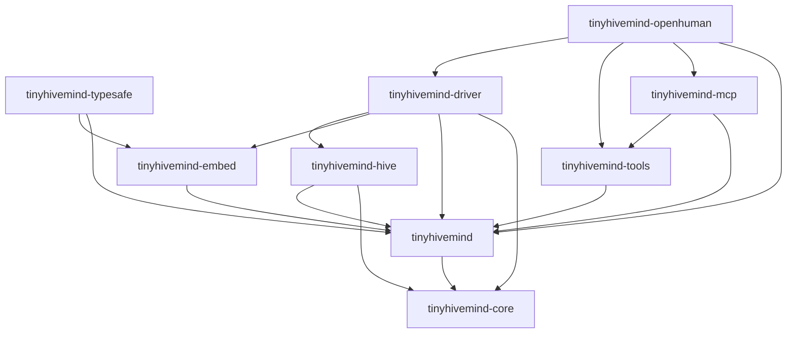

# How the crates use each other

This page records direct, normal Cargo dependencies between the nine workspace
crates. An arrow points from the crate that depends on another crate to the
crate it imports. It says nothing about which crate calls first at runtime.
The individual crate READMEs explain the APIs used at each edge.

| Crate | Direct workspace dependencies | What it takes from them |
| --- | --- | --- |
| [core](../crates/tinyhivemind-core/README.md) | None | Owns the pure desk, roster, mention, approval, and responder algebra. |
| [runtime](../crates/tinyhivemind/README.md) | core | Uses pure decisions and re-exports core's public surface. |
| [hive](../crates/tinyhivemind-hive/README.md) | runtime, core | Reads attributed session types; uses core masking and errors; re-exports runtime. |
| [embed](../crates/tinyhivemind-embed/README.md) | runtime | Reuses sequence and fixed-point probability types for host-neutral routing. |
| [TypeSafe](../crates/tinyhivemind-typesafe/README.md) | runtime, embed | Implements embed's `Router` with the runtime's probability scale. |
| [driver](../crates/tinyhivemind-driver/README.md) | runtime, core, embed, hive | Combines utterances, desk validation, routing, and completion folds. |
| [tools](../crates/tinyhivemind-tools/README.md) | runtime | Renders and interprets the runtime's speech vocabulary. |
| [MCP](../crates/tinyhivemind-mcp/README.md) | tools, runtime | Serves the tool record over MCP; its direct runtime dependency supports wire tests. |
| [OpenHuman](../crates/tinyhivemind-openhuman/README.md) | runtime, driver, tools, MCP | Runs driver decisions on OpenHuman seats and connects native or MCP tools. |

Three public re-exports shorten a host's dependency list. `tinyhivemind`
re-exports core, `tinyhivemind-hive` re-exports the runtime, and
`tinyhivemind-mcp` re-exports the main tool record types. A re-export does
not reverse the Cargo dependency. An application can depend on a narrower
crate when it does not need the layer above it.

For a completion episode, the hive crate defines the pure episode state and
folds. The driver combines those folds with routing and committed-event
bookkeeping. The OpenHuman adapter runs seats selected by the driver. The
tools crate records seat calls; the MCP crate provides a socket for a seat
that cannot receive native tools. The host still owns the transcript, durable
appends, and agent lifecycle.
